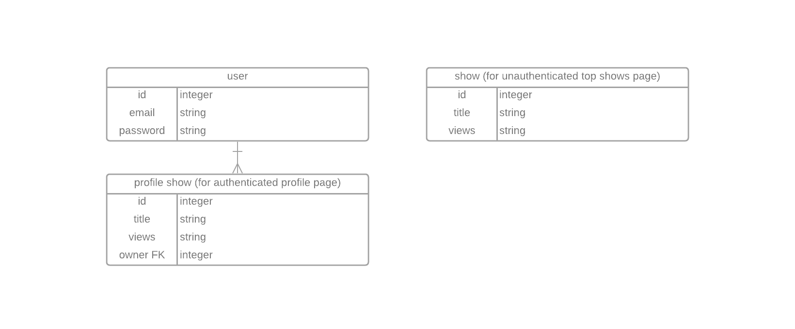
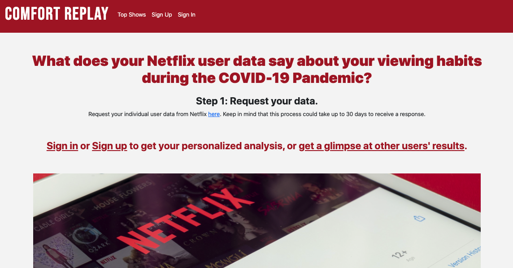
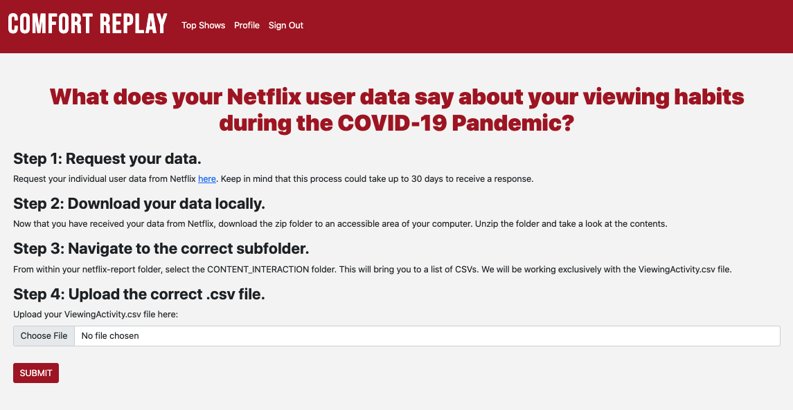
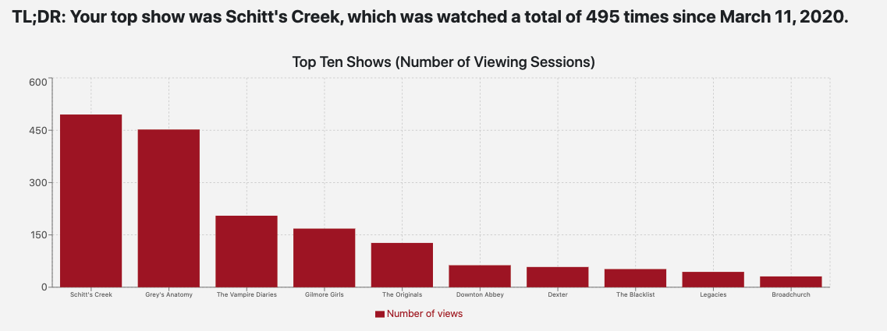
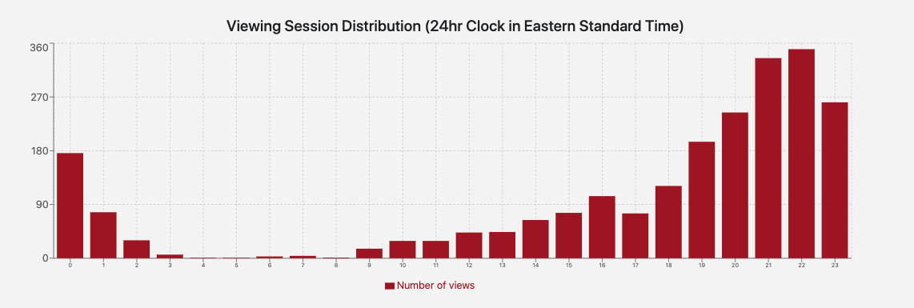

# What does your Netflix user data say about your viewing habits during the COVID-19 Pandemic?

Cover letters are becoming more prominent in the job hunt across all industries. An effective cover letter often involves additional research on the company itself and also careful reading of the job description. Using natural language processing, Cover Letter Inspo provides word suggestions for your cover letter based on the job description.

## Tech stack

Django, Python, React

## User flows

As a user, I want to:
- log in to use the web application
- upload the required csv with ease
- view my analyzed data, including top shows viewed and 24-hr viewing patterns
- view others' top shows

## Wireframes


## Entity Relationship Diagram



## Data analysis using pandas

- To clean and analyse the data, the [pandas](https://pandas.pydata.org/docs/index.html) library will be used in Python with the specific focus of returning frequency distributions


## MVP goals

- send .csv data from user upload to the server for data analysis using pandas
- return modified data to frontend for data visualizations
- save number one viewed show name and number of views to database as a key-value pair
- display page of all users' number one viewed show and number of times viewed
- achieve total functionality of React frontend interactions with Django backend

### Stretch goals

- add/delete comments on page display of all users' top show names/view count
- mobile functionality
- fine-tune user experience

### Project screenshots






### Local deployment

- Install the LTS version of node.js from [here](https://nodejs.org/en/)
- In a terminal, clone this repo

```sh
git clone https://github.com/Mackmiller/comfort-replay-client.git
```

- Navigate to the repo folder

```sh
cd comfort-replay-client
```

- Install the project dependencies:

```sh
npm install
```

- Deploy the project on your local machine

```sh
npm start
```

- for Part 2 of deployment, please see the server repo [here](https://github.com/Mackmiller/comfort-replay-server)

## Cloud Deployment

Both the server and client repos are deployed on Heroku [here](https://comfort-replay.herokuapp.com/)

## Contributors

- [Mackenzie Miller](https://github.com/Mackmiller)